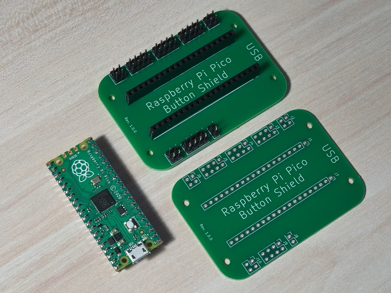

# Raspberry Pi Pico Button Shield

## Overview

Design files for Raspberry Pi Pico Button Shield.
Simplifies adding multiple buttons to Pico projects for cleaner wiring and easier prototyping.
Supports up to 23 tactile buttons (GP0-GP22).

