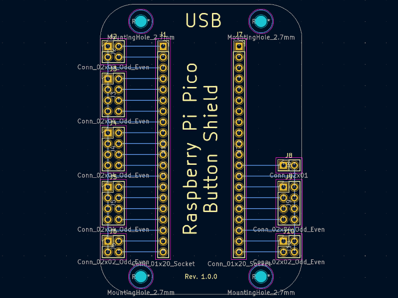

# Raspberry Pi Pico Button Shield

KiCad design files for a simple shield for the Raspberry Pi Pico.
The shield is designed to easily break out most of the Pico's GPIO pins
to multiple 2-pin 2.54mm pitch male headers.
This makes it convenient for connecting external components like buttons,
switches, LEDs, or sensors using standard Dupont wires.
Ideal for prototyping or creating simple custom interfaces.




## Features

* Directly fits onto a Pico or Pico W (requires headers soldered on the Pico).
* Breaks out most Pico pins into pairs on standard 2.54mm pitch male headers.
* Includes four 2.7mm mounting holes.
* Simple PCB design (requires only through-hole headers to be soldered).

## Usage

This example demonstrates reading multiple buttons connected to the shield
using the [SimpleButton][1] module on [MicroPython][2].

```python
import sys
from utime import sleep_ms
from machine import Pin
from simple_button import SimpleButton


def echo(message: str) -> None:
    sys.stdout.write(f"{message} \n")


def main() -> None:
    gpio = list(range(23))
    buttons: list[SimpleButton] = []

    for index, gpio_pin in enumerate(gpio):
        buttons.append(
            SimpleButton(
                gpio_pin,
                press_callback=lambda i=index: echo(f"Button {i} pressed"),
                release_callback=lambda i=index: echo(f"Button {i} released"),
                pull=Pin.PULL_UP,
                active_low=True
            )
        )

    while True:
        # Do other things or just sleep
        sleep_ms(500)


if __name__ == "__main__":
    main()

```

[1]: https://github.com/evgenii-d/micropython-simple-button
[2]: https://docs.micropython.org/en/latest/rp2/quickref.html
